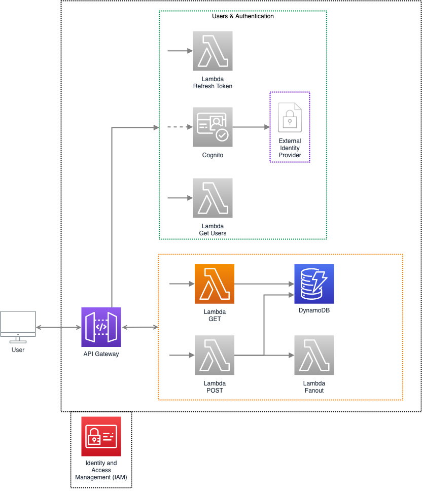
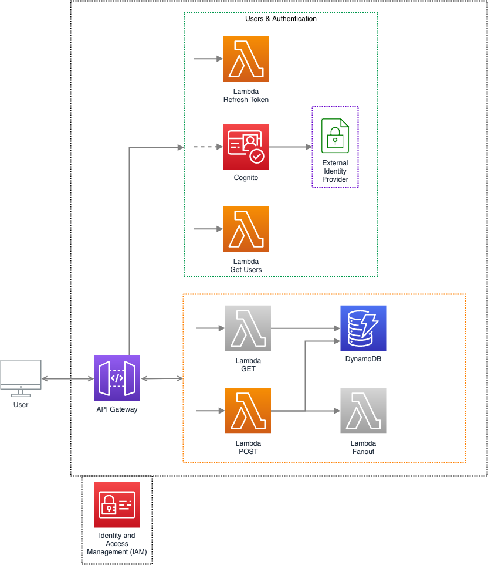
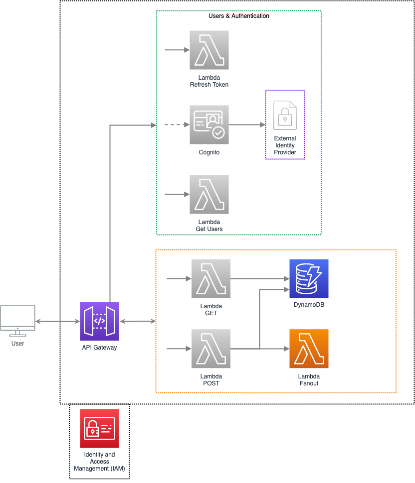

## API Security and Authentication Overview

Considering that not all Lambda functions should be public, different APIs in a system will require different levels of authentication and access.

### Public APIs

Public APIs are endpoints that don't require the user to be authenticated first.

In this example, the `GET` endpoint is public.



### Authenticated APIs

Authenticated APIs are endpoints that require the user to be authenticated first.

These are generally API endpoints that may have functionality that updates the system state on a user's behalf:

- **Updating a user Profile**
- **Place and managing orders**

In this example, the `POST` endpoint should be authenticated with Cognito using Cognito User Pool, or Cognito Federated Identities.



### Internal / System APIs

Internal APIs are endpoints that will only be utilized by internal systems and microservices and are not consumed by the client app.

These are generally API endpoints that:

- **Process data or files**
- **Manage push messaging to the client**
- **Handle email or SMS notifications**

In this example, the `Fanout` Lambda is only called internally and should be authenticated with IAM permissions.



<!-- ------------------------------------------------------------------------------------------------------- -->

## Cognito User Pool and Cognito Federated Identities

AWS Cognito manages user sign-ups and authentication and also has the functionality to synchronize user profiles across devices.

### Cognito User Pool

Cognito User Pool is a managed identity service that handles registration / registration verification / authentication and password policies.

During user authentication, Cognito provides temporary credentials to use to access other AWS resources or APIs in API Gateway.

#### New User Registration Flow

When a user registers and confirms their email, the client talks with Cognito User Pool:

1. **Client:** Registers a new account.
2. **Cognito User Pool:** Sends a verification token.
3. **Client:** Confirms the verification token.
4. **Cognito User Pool:** Completes the registration process.

```
Client         Cognito User Pool         API Gateway            AWS Lambda
  |                      |                    |                     |
  | Register             |                    |                     |
  | New Account          |                    |                     |
  | -------------------► |                    |                     |
  |                      |                    |                     |
  | ◄------------------- |                    |                     |
  |    Send Verification  |                    |                     |
  |               Token  |                    |                     |
  |        (Email / SMS) |                    |                     |
  |                      |                    |                     |
  |                      |                    |                     |
  |                      |                    |                     |
  |                      |                    |                     |
  |                      |                    |                     |
  | Confirm               |                    |                     |
  | Verification          |                    |                     |
  | Token                |                    |                     |
  | -------------------► |                    |                     |
  |                      |                    |                     |
  | ◄------------------- |                    |                     |
  |         Registration |                    |                     |
  |             Complete |                    |                     |
  |                      |                    |                     |
```

#### Authentication Sign In Flow

After a successful sign-in, Cognito User Pool returns a JWT token. This token needs to be passed in future HTTP headers for authentication in API Gateway.

1. **Client:** Signs in with username and password.
2. **Cognito User Pool:**

   - Authenticates the user with username and password.
   - Returns an ID token with JWT.

3. **Client:** Includes the JWT in the header of HTTP requests to API Gateway that are secured with the Cognito authorizer.

```
Client           Cognito User Pool       API Gateway           AWS Lambda
  |                      |                    |                     |
  | Sign In              |                    |                     |
  | -------------------► |                    |                     |
  |                      |                    |                     |
  | ◄------------------- |                    |                     |
  |             ID Token |                    |                     |
  |                (JWT) |                    |                     |
  |                      |                    |                     |
  |                      |                    |                     |
  |                      |                    |                     |
  |                      |                    |                     |
  |                      |                    |                     |
  | HTTP POST { authorization: ... }          |                     |
  | ----------------------------------------► |                     |
  |                      |                    | ------------------► |
  |                      |                    | ◄------------------ |
  | ◄---------------------------------------- |                     |
  |                      |          200 {...} |                     |

```

### Cognito Federated Identities

Cognito Federated Identities allows authentication with a supported identity provider (Google, Facebook, Twitter, etc).

The auth token issued by an auth provider is exchanged for temporary AWS IAM credentials, which can be used to access other AWS services.

1. App / Client authenticates with a **3rd party identity provider**
2. The identity provider returns an **auth token**
3. The auth token is sent to **Cognito Federated Identities**
4. Cognito Federated Identities **validates the auth token with the identity provider**
5. If the auth token is valid, Cognito will **issue a temporary AWS IAM credential** to the Client
6. The client can now **access other AWS services using the temporary AWS IAM credential**

```

     Identity Providers
     ┌────────────────────────────────────────────────────────┐
     |                                                        |
     | Google     Cognito User Pool     Facebook     Twitter  |
     |                                                        |
     └────────────────────────────────────────────────────────┘
               ▲   | Issues                        ▲
               |   | Auth Token                    |
               |   |                               |
               |   |                               |
  Authenticate |   |                               | Validate
  (Login)      |   ▼              Send             | Auth Token
    ┌─────────────────┐           Auth Token  ┌────────────────┐
    |                 | --------------------► |   Cognito      |
    |   App / Client  |                       |   Federated    |
    |                 | ◄-------------------- |   Identities   |
    └─────────────────┘        Temporary IAM  └────────────────┘
           |                        Credential
           | Use
           | IAM Credential
           |
           ▼                                     AWS Services
     ┌────────────────────────────────────────────────────────┐
     |                                                        |
     | API Gateway    S3    DynamoDB    SNS    Kinesis    ... |
     |                                                        |
     └────────────────────────────────────────────────────────┘

```

### Securing a Lambda Function with Cognito

To require that the caller be authenticated with Cognito to invoke your Lambda Function, create the Cognito authorizer as CloudFormation resource, and set the authorizer for the lambda function to Cognito User Pool.

_Note that we'll also have to add a new Cognito User Pool resource, `CognitoUserPool`, and add the web and server clients._

Construct the `CognitoAuthorizer` as a CloudFormation resource and then reference it in each function. The `ProviderARNs` attribute for the `CognitoAuthorizer` resource will point to the ARN of the `CognitoUserPool` resource.

<div class="filename">serverless.yml</div>

```yml{3,12}
resources:
  Resources:
    CognitoAuthorizer:
      Type: AWS::ApiGateway::Authorizer
      Properties:
        AuthorizerResultTtlInSeconds: 300
        IdentitySource: method.request.header.Authorization
        Name: Cognito
        RestApiId: !Ref ApiGatewayRestApi
        Type: COGNITO_USER_POOLS
        ProviderARNs:
          - !GetAtt CognitoUserPool.Arn
```

<div class="filename">serverless.yml</div>

```yml{8-10}
functions:
  search-stores:
    handler: functions/search-stores.handler
    events:
      - http:
          path: /stores/search
          method: post
          authorizer:
            type: COGNITO_USER_POOLS
            authorizerId: !Ref CognitoAuthorizer
```

<div class="filename">serverless.yml</div>

```yml{3-37,39-47,49-57}
resources:
  Resources:
    CognitoUserPool:
      Type: AWS::Cognito::UserPool
      Properties:
        AliasAttributes:
          - email
        UsernameConfiguration:
          CaseSensitive: false
        AutoVerifiedAttributes:
          - email
        Policies:
          PasswordPolicy:
            MinimumLength: 8
            RequireLowercase: true
            RequireNumbers: true
            RequireUppercase: true
            RequireSymbols: true
        Schema:
          - AttributeDataType: String
            Mutable: true
            Name: given_name
            Required: true
            StringAttributeConstraints:
              MinLength: "1"
          - AttributeDataType: String
            Mutable: true
            Name: family_name
            Required: true
            StringAttributeConstraints:
              MinLength: "1"
          - AttributeDataType: String
            Mutable: true
            Name: email
            Required: true
            StringAttributeConstraints:
              MinLength: "1"

    WebCognitoUserPoolClient:
      Type: AWS::Cognito::UserPoolClient
      Properties:
        ClientName: web
        UserPoolId: !Ref CognitoUserPool
        ExplicitAuthFlows:
          - ALLOW_USER_SRP_AUTH
          - ALLOW_REFRESH_TOKEN_AUTH
        PreventUserExistenceErrors: ENABLED

    ServerCognitoUserPoolClient:
      Type: AWS::Cognito::UserPoolClient
      Properties:
        ClientName: server
        UserPoolId: !Ref CognitoUserPool
        ExplicitAuthFlows:
          - ALLOW_ADMIN_USER_PASSWORD_AUTH
          - ALLOW_REFRESH_TOKEN_AUTH
        PreventUserExistenceErrors: ENABLED
```

<div class="filename">serverless.yml</div>

```yml{12-14,18-52,54-62,64-72,74-83}
provider:
  name: aws
  runtime: nodejs12.x

functions:
  search-stores:
    handler: functions/search-stores.handler
    events:
      - http:
          path: /stores/search
          method: post
          authorizer:
            type: COGNITO_USER_POOLS
            authorizerId: !Ref CognitoAuthorizer

resources:
  Resources:
    CognitoUserPool:
      Type: AWS::Cognito::UserPool
      Properties:
        AliasAttributes:
          - email
        UsernameConfiguration:
          CaseSensitive: false
        AutoVerifiedAttributes:
          - email
        Policies:
          PasswordPolicy:
            MinimumLength: 8
            RequireLowercase: true
            RequireNumbers: true
            RequireUppercase: true
            RequireSymbols: true
        Schema:
          - AttributeDataType: String
            Mutable: true
            Name: given_name
            Required: true
            StringAttributeConstraints:
              MinLength: "1"
          - AttributeDataType: String
            Mutable: true
            Name: family_name
            Required: true
            StringAttributeConstraints:
              MinLength: "1"
          - AttributeDataType: String
            Mutable: true
            Name: email
            Required: true
            StringAttributeConstraints:
              MinLength: "1"

    WebCognitoUserPoolClient:
      Type: AWS::Cognito::UserPoolClient
      Properties:
        ClientName: web
        UserPoolId: !Ref CognitoUserPool
        ExplicitAuthFlows:
          - ALLOW_USER_SRP_AUTH
          - ALLOW_REFRESH_TOKEN_AUTH
        PreventUserExistenceErrors: ENABLED

    ServerCognitoUserPoolClient:
      Type: AWS::Cognito::UserPoolClient
      Properties:
        ClientName: server
        UserPoolId: !Ref CognitoUserPool
        ExplicitAuthFlows:
          - ALLOW_ADMIN_USER_PASSWORD_AUTH
          - ALLOW_REFRESH_TOKEN_AUTH
        PreventUserExistenceErrors: ENABLED

    CognitoAuthorizer:
      Type: AWS::ApiGateway::Authorizer
      Properties:
        AuthorizerResultTtlInSeconds: 300
        IdentitySource: method.request.header.Authorization
        Name: Cognito
        RestApiId: !Ref ApiGatewayRestApi
        Type: COGNITO_USER_POOLS
        ProviderARNs:
          - !GetAtt CognitoUserPool.Arn

  Outputs:
    CognitoUserPoolId:
      Value: !Ref CognitoUserPool

    CognitoUserPoolArn:
      Value: !GetAtt CognitoUserPool.Arn

    CognitoUserPoolWebClientId:
      Value: !Ref WebCognitoUserPoolClient

    CognitoUserPoolServerClientId:
      Value: !Ref ServerCognitoUserPoolClient

plugins:
  - serverless-pseudo-parameters
```

<!-- ------------------------------------------------------------------------------------------------------- -->

## Securing a Lambda Function with IAM

**To require that the caller submit IAM access keys to be authenticated to invoke your Lambda Function, set the authorizer to `aws_iam`.**

Generally, Lambdas that are only accessed by your infrastructure (and are not intended to be called by the client directly), should be restricted access by IAM role-based permissions

IAM authorization also makes sense as the caller will already be running within AWS and will already have an IAM role.

### Manually signing with the aws4 NPM Package

In order to invoke a Lambda that is secured with an IAM authorizer, we'll need to sign and prepare our requests using <a href='https://docs.aws.amazon.com/general/latest/gr/sigv4_signing.html' target='_blank'>AWS Signature Version 4</a>.

Add the <a href='https://github.com/mhart/aws4' target='_blank'>aws4</a> NPM package.

```terminal
$ yarn add aws4
```

Add the `execute-api:Invoke` to the IAM execution role in the `iamRoleStatements` property:

**Quick Note:**

- `execute-api:invoke` permission allows calling API Gateway endpoints.
- `lambda:InvokeFunction` permission allows directly invoking lambdas, bypassing API gateway.

<div class="filename">serverless.yml</div>

```yml{7-8,26}
provider:
  name: aws
  runtime: nodejs12.x

  iamRoleStatements:
    - Effect: Allow
      Action: execute-api:Invoke
      Resource: arn:aws:execute-api:#{AWS::Region}:#{AWS::AccountId}:#{ApiGatewayRestApi}/${self:provider.stage}/GET/stores
```

In this example, we're going to have the `get-index` function call the `get-stores` function through API Gateway:

**To require that the caller submit the IAM user's access keys to be authenticated to invoke your Lambda Function, use the `aws_iam` authorizer for `get-stores` endpoint.**

We'll also need the URL of the `/stores` API Gateway endpoint, so we're passing the URL in as an environment variable, `stores_api`:

<div class="filename">serverless.yml</div>

```yml{9,17}
functions:
  get-index:
    handler: functions/get-index.handler
    events:
      - http:
          path: /
          method: get
    environment:
      stores_api: https://#{ApiGatewayRestApi}.execute-api.#{AWS::Region}.amazonaws.com/${self:provider.stage}/stores

  get-stores:
    handler: functions/get-stores.handler
    events:
      - http:
          path: /stores
          method: get
          authorizer: aws_iam
```

The `aws4` package prepares the `opts` object with a `headers` property using the URL of the `get-stores` function.

We pass this authentication header into our HTTP request to the `get-stores` URL:

<div class="filename">/functions/get-index.js</div>

```js{5,10-13,15,18}
const http = require("axios");
const aws4 = require("aws4");
const URL = require("url");

const storesApi = process.env.stores_api;

const getStores = async () => {
  const url = URL.parse(storesApi);

  const opts = {
    host: url.hostname,
    path: url.pathname,
  };

  aws4.sign(opts);

  const httpReq = http.get(storesApi, {
    headers: opts.headers,
  });

  return (await httpReq).data;
};

module.exports.handler = async (event, context) => {
  const stores = await getStores();

  const response = {
    statusCode: 200,
    body: stores,
  };

  return response;
};
```

We can test and see that the `get-stores` endpoint is now secure by trying to hit the `/stores` API endpoint directly:

```terminal
$ curl -X GET https://xxxxxxxxxxxx.execute-api.us-east-1.amazonaws.com/dev/stores


{
  message: "Missing Authentication Token"
}
```

<!-- ### Using Javascript SDK

- lambda node.js code is using the AWS node SDK, which should be picking up permissions from the instance environment
- The execution role provides the Lambda function with the credentials it needs to run and to invoke other web services
- API handler only has permissions from the statically defined execution role

```yml
provider:
  name: aws
  runtime: nodejs12.x
  iamRoleStatements:
    - Effect: Allow
      Action: lambda:InvokeFunction
      Resource: arn:aws:lambda:#{AWS::Region}:#{AWS::AccountId}:function:manning-serverless-dev-get-stores

functions:
  get-index:
    handler: functions/get-index.handler
    events:
      - http:
          path: /
          method: get
    environment:
      stores_api: YOUR_DEPLOYED_API_URL
  get-stores:
    handler: functions/get-stores.handler
    events:
      - http:
          path: /stores/
          method: get
          private: true
          authorizer: aws_iam
```

```js
// const AWS = require("aws-sdk");
const Lambda = require("aws-sdk/clients/lambda");

const lambda = new Lambda({
  region: "us-east-1",
});

async function getStores() {
  const params = {
    FunctionName: "manning-serverless-dev-get-stores",
    InvocationType: "RequestResponse",
  };
  const data = await lambda.invoke(params).promise();

  const dataPayload = JSON.parse(data.Payload);
  return JSON.parse(dataPayload.body);
}

module.exports.handler = async (event, context) => {
  let stores = await getStores();

  // ...

  const response = {
    statusCode: 200,
    body: html,
    headers: {
      "Content-Type": "text/html; charset=UTF-8",
    },
  };

  return response;
};
``` -->

<!-- ------------------------------------------------------------------------------------------------------- -->

<!-- ## Custom authorizer

- Can also use custom authorizers for authenticating and authorizing users
- When a client requests API Gateway if a policy doesn't exist for this client already, as identified by the client's authentication token in the request

- API Gateway invokes and caches the policies for you,
- API Gateway will invoke this custom authorization function, which will return a JSON payload with a policy object for this user.
- For successfully authenticated requests, the policy would then be cached for future requests. API Gateway would then forward the request to the configured integration endpoint -->

<!-- ------------------------------------------------------------------------------------------------------- -->

## Securing a Lambda Function with API Keys

We can also use API keys and Usage Plans to restrict a client's access on selected APIs to an agreed-upon request rate and quota.

**It should be noted that API keys are designed for rate-limiting individual clients rather than for authentication and authorization.**

> API key quotas apply to all APIs and Stages
>
> The request rate and quota assigned to an API key apply to all the APIs AND the **stages** covered by the current usage plan.

In this example, we're going to have the `get-index` function call the `get-stores` function through API Gateway:

**To require that the caller pass an API key to invoke your Lambda Function, set the `private` boolean property to the `http` event object for the `get-stores` endpoint.**

We'll also need the URL of the /stores API Gateway endpoint, so we're passing the URL in as an environment variable, stores_api:

<div class="filename">serverless.yml</div>

```yml{9,17}
functions:
  get-index:
    handler: functions/get-index.handler
    events:
      - http:
          path: /
          method: get
    environment:
      stores_api: https://#{ApiGatewayRestApi}.execute-api.#{AWS::Region}.amazonaws.com/${self:provider.stage}/stores

  get-stores:
    handler: functions/get-stores.handler
    events:
      - http:
          path: /stores
          method: get
          private: true
```

We'll also need to create a Usage Plan to specify the rate limit and quota for the number of requests a client can make, and associate the API keys with a usage plan.

You can set up a <a href='https://www.serverless.com/framework/docs/providers/aws/events/apigateway/#setting-api-keys-for-your-rest-api' target='_blank'>general Usage Plan</a> that all API keys will use, but I like to have specific Usage Plan categories and assign keys to each specific category.

In this example, the Usage Plan category names are:

- `free`
- `paid`

And we've generated two API key names.

- `freeKey`, assigned to the `free` Usage Plan category.
- `paidKey`, assigned to the `paid` Usage Plan category.

In our implementation, we're specifying the API key names and allowing AWS to generate the actual keys for each API key.

<div class="filename">serverless.yml</div>

```yml{7,9,11-18,19-26}
provider:
  name: aws
  runtime: nodejs12.x

  apiKeys:
    - free:
        - freeKey
    - paid:
        - paidKey
  usagePlan:
    - free:
        quota:
          limit: 5000
          offset: 2
          period: MONTH
        throttle:
          burstLimit: 200
          rateLimit: 100
    - paid:
        quota:
          limit: 50000
          offset: 1
          period: MONTH
        throttle:
          burstLimit: 2000
          rateLimit: 1000
```

After you redeploy the stack, the API key name and values will be returned in the Serverless CLI output:

```bash{15,16}
$ sls deploy

Serverless: Packaging service...
...
Serverless: Stack update finished...

Service Information
service: stores-service
stage: dev
region: us-east-1
stack: stores-service-dev
resources: 33

api keys:
  freeKey: xxxxxxxxxxxxx
  paidKey: xxxxxxxxxxxxx

endpoints:
  GET - https://xxxxxxxxx.execute-api.us-east-1.amazonaws.com/dev/
  GET - https://xxxxxxxxx.execute-api.us-east-1.amazonaws.com/dev/stores
  POST - https://xxxxxxxxx.execute-api.us-east-1.amazonaws.com/dev/stores/search

functions:
  get-index: stores-service-dev-get-index
  get-stores: stores-service-dev-get-stores
  search-stores: stores-service-dev-search-stores

layers:
  None
```

Now that the `get-stores` Lambda has the `private` boolean, API calls to `get-stores` now need to pass an API key in the `x-api-key` HTTP header of the request.

<div class="filename">/functions/get-index.js</div>

```js{8}
const http = require("axios");

const restaurantsApiRoot = process.env.restaurants_api;

const getRestaurants = async () => {
  const httpReq = http.get(restaurantsApiRoot, {
    headers: {
      "x-api-key": "xxxxxxxxx",
    },
  });

  return (await httpReq).data;
};

module.exports.handler = async (event, context) => {
  let stores = await getStores();

  // ...

  const response = {
    statusCode: 200,
    body: stores,
  };

  return response;
};
```
