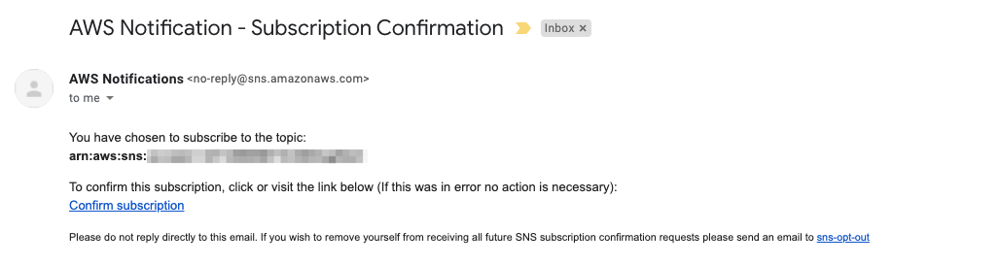

It's a good practice to set up billing alerts when you're first getting started with AWS to avoid unexpected charges than can be caused by forgetting to clean up and remove unused services.

## Enable Billing Alerts in "Billing preferences"

1. Navigate to <a href='https://console.aws.amazon.com/billing/home?region=us-east-1#/preferences' target='_blank'>My Billing Dashboard > Billing preferences</a>
2. Enable **"Receive Free Tier Usage Alerts"** to receive email alerts when AWS service usage is approaching, or has exceeded, the AWS Free Tier usage limits.
3. Enter the **Email Address to send the alerts to**
4. Enable **"Receive Billing Alerts"** to send billing alerts to via email when your charges reach a specified threshold.

## Create a CloudWatch Billing Alarm

1. Navigate to <a href='https://console.aws.amazon.com/cloudwatch/home?region=us-east-1#alarmsV2:!namespace=AWS/Billing' target='_blank'>CloudWatch > Alarms > Billing</a>
2. **"Create Alarm"**

 
 

1. Specify the **threshold dollar value** to trigger an alarm

Here, the dollar threshold value is \$10 USD

2. Click **Next**

 
 

3. **Create a new SNS topic** for Billing Alerts
4. Specify the **email address to send Billing Alerts** to
5. Click **"Create topic"**
6. Click **Next**

 
 

7. Set the **Alarm Name and Description**
8. Click **Next**

 
 

9. Review the summary of the alarm to be created
10. Click **Create alarm**

 
 

The CloudWatch Billing alarm is created. However, we need to confirm the SNS Subscription.

11. Click **"View SNS Subscriptions"**

## Confirm the SNS Subscription

1. Navigate to <a href='https://console.aws.amazon.com/sns/v3/home?region=us-east-1#/subscriptions' target='_blank'>Amazon SNS > Subscriptions</a>

We can see that the new SNS subscription is **"Pending confirmation"**

 
 

2. Go to the email inbox you designated for alerts and find the email **"AWS Notification - Subscription Confirmation"**

3. Click **"Confirm subscription"**

 
 

 
 

You'll now see in Amazon SNS that the subscription has been confirmed

